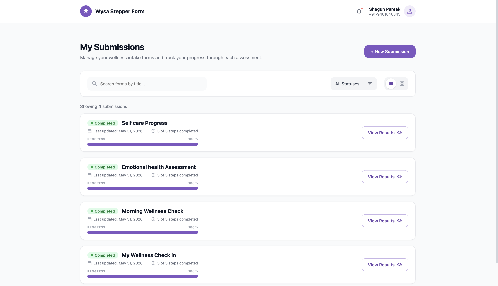
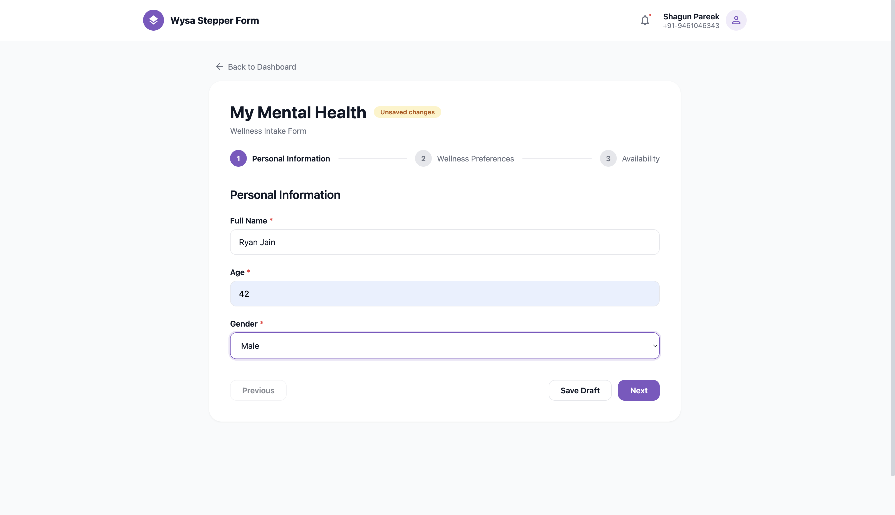
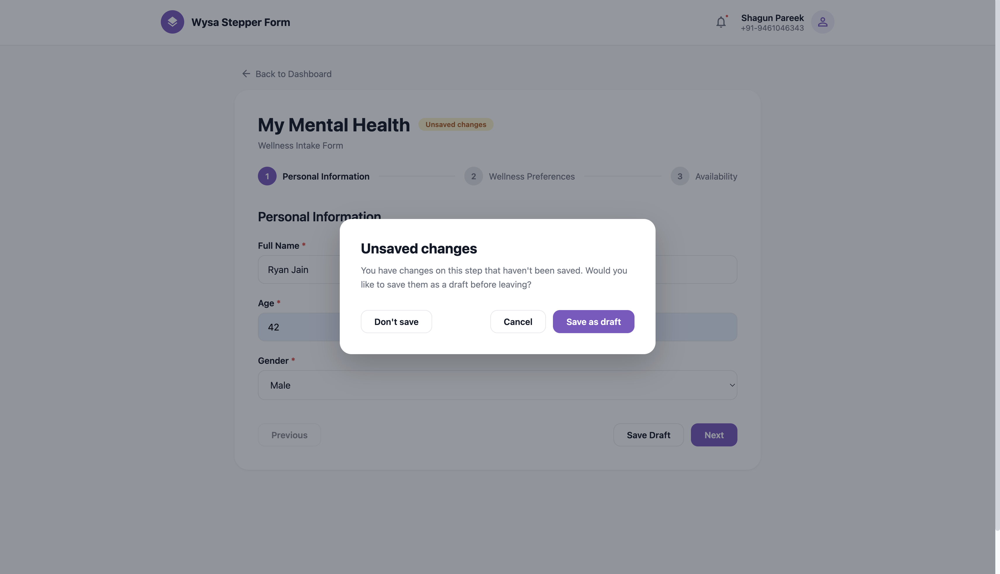

# Wysa Take-Home Assignment

A dynamic multi-step form application built using React, Express, and MongoDB. Users can create submissions, save drafts, resume progress, and submit completed forms.

---

## Functionalities

* Built both Frontend using React and Backend using Node.js/Express.js.
* Dashboard to view all form submissions along with their current status and completion progress in the card itself.
* Implemented dynamic progress tracking based on completed steps versus total configured steps.
* Added support for creating and managing multiple form submissions.

---

## Dynamic Form Engine

* Designed a backend driven form configuration system, allowing form structure to be controlled without frontend code changes.
* Implemented a configurable multi-step workflow with support for custom step definitions.
* Built dynamic form rendering capable of handling multiple field types:

  * Text Inputs
  * Select Dropdowns
  * Radio Buttons
* Added support for required fields and field-level validation rules.

---

## Draft

* User can save partially completed forms as drafts.
* Implemented seamless draft recovery, which allows user to continue from where they left off.
* Ensured draft data persists across browser refreshes and application restarts.
* **Explicit save only:** progress is stored only when the user clicks **Save Draft** or chooses **Save as draft** in the leave confirmation modal. Navigating away without saving does not create or update a submission record.
* If a user starts a new form and abandons it without saving, no database entry is created. This is intentional — unsaved changes are not persisted automatically.

---

## Validation & Edge Cases Handling

* Prevented progression where the required fields are empty.
* Added defensive validation for:

  * Invalid form submissions
  * Invalid step navigation
  * Unsupported field values
  * Corrupted or incomplete form configurations

---

## TECH STACK

### Frontend

* React
* Vite
* Material UI (a little)
* Axios
* React Router

### Backend

* Node.js
* Express.js
* MongoDB
* Mongoose

---

## Project Structure

### client/

The frontend of the application. It handles the Stepper Form UI, displays submission data, manages user interactions, performs basic validations, and communicates with the backend through API calls.

### server/

The backend of the application. It stores and manages form configurations, handles draft and submission workflows, validates incoming data, interacts with the database, and exposes the APIs used by the frontend.

---

## Running the Application

### Frontend

```bash
cd client
npm install
npm run dev
```

### Backend

```bash
cd server
npm install
npm run dev
```

Returns the form configuration used to dynamically render the stepper form.

---

## Screenshots

### Dashboard


### Dynamic Multi-Step Form


### Unsaved state change


---

## Assumptions & Design Decisions

* Form structure is fully driven through backend configuration.
* A submission can exist in either draft or completed state.
* Drafts can be resumed at any point using the saved submission ID.
* Validation is enforced before progressing through required fields.
* Progress tracking is calculated dynamically based on the current step and total configured steps.
* **Start New Form** creates a new submission instance against the single backend-driven wellness intake template — not a custom form builder.
* Text fields allow emojis (e.g. "Feeling great 😄") but require at least one word when a value is provided, so emoji-only input is rejected.

---

## Future Improvements

* Authentication and user-specific submissions.
* Auto-save functionality.
* Advanced field validation rules.
* Form builder interface for administrators.
* Submission analytics and reporting dashboard.
* Support for additional field types and conditional workflows.
